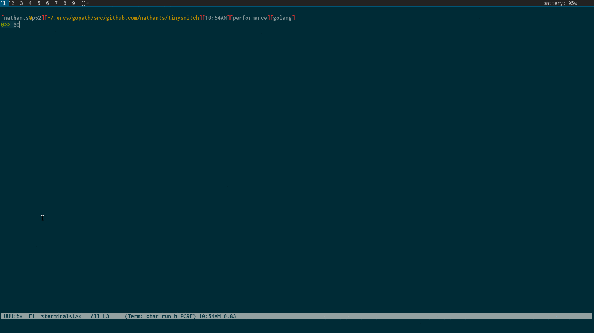
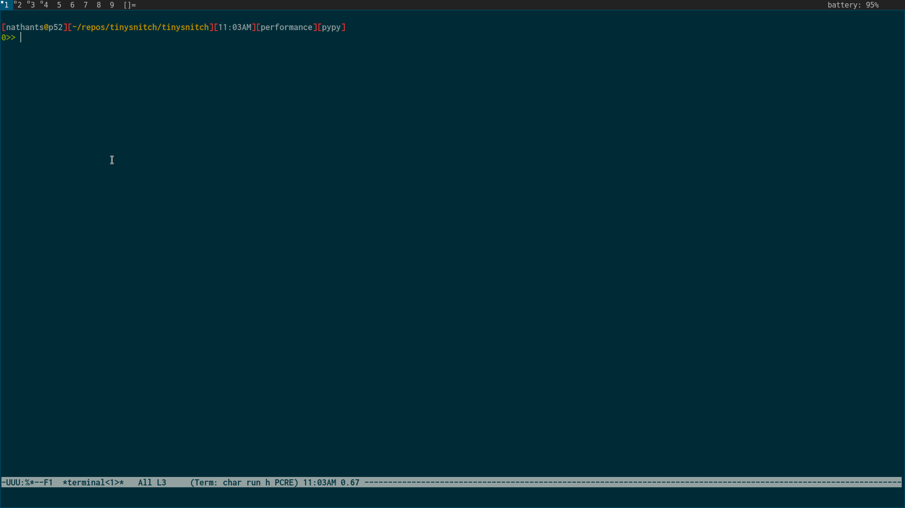
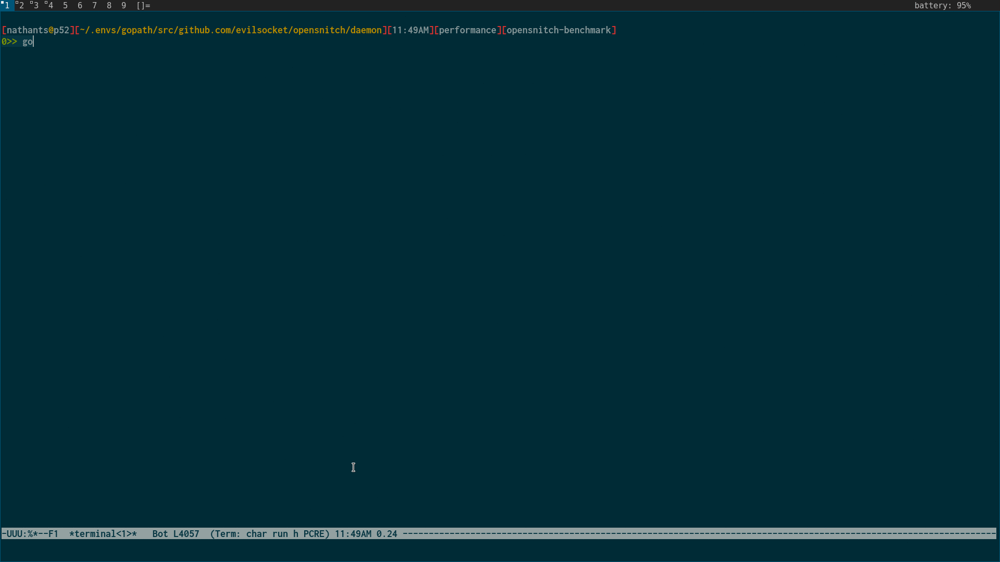
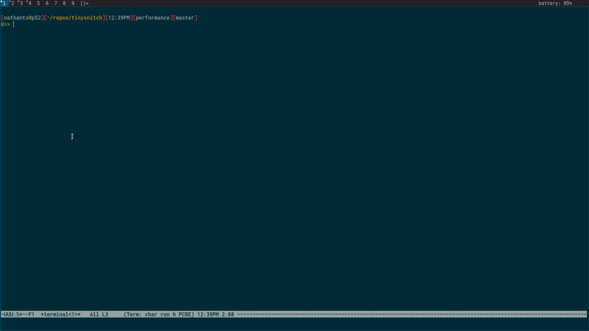
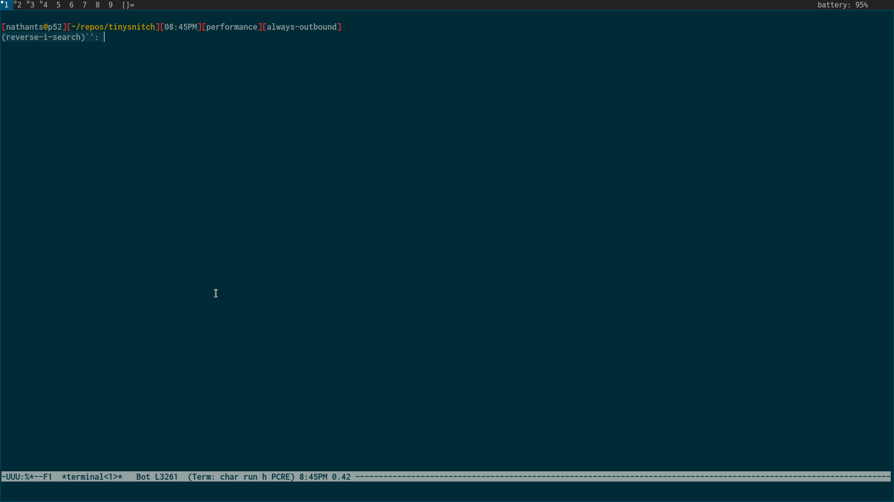

here are some rough benchmarks, running [siege](https://www.joedog.org/siege-home/) against a [ran](https://github.com/m3ng9i/ran) http server.

without any firewall we get about 20k/sec.

the [simplest possible](https://github.com/nathants/tinysnitch/tree/golang) golang implementation approving all packets gets about 11k/sec.

the [simplest possible](https://github.com/nathants/tinysnitch/tree/pypy) pypy implementation approving all packets gets about 9k/sec.

a [simplified opensnitch](https://github.com/nathants/tinysnitch/tree/opensnitch-benchmark) approving all packets after proc lookup gets about 250/sec.

tinysnitch approving all inbount packets after proc lookup gets about 8k/sec. the rules whitelist `ran`.

tinysnitch approving all outbound packets after proc lookup gets about 8k/sec. the rules whitelist `siege`. a [branch](https://github.com/nathants/tinysnitch/tree/always-outbound) allows local benchmarking of outbound connections.

