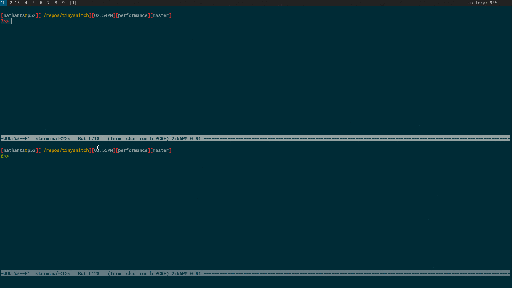
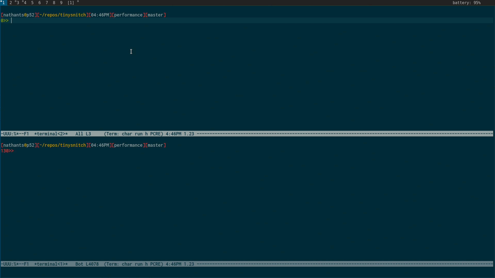

## why

it is suprising how many programs are making dns requests. it's even more surprising how many domains the typical website resolves. most importantly, it should be easy to monitor and control inbound and outbound connections from one's workstation.

## what

an interactive firewall for inbound and outbound connections, with visual, keyboard controlled prompts.

based on the excellent [opensnitch](https://github.com/evilsock/opensnitch) and it's brilliant use of libnetfilter_queue.

## dependencies

 - everything in `tinysnitch/bin` is a seperate component, with seperate dependencies. you can run them independently to make sure dependencies are correctly installed.

 - tinysnitchd:
   - [pypy3](https://pypy.org/)
   - [ss](https://linux.die.net/man/8/ss)

 - tinysnitch-bcc-*:
   - [bcc](https://github.com/iovisor/bcc)
   - [python2](https://www.python.org/)

 - tinysnitch-bpftrace-*:
   - [bpftrace](https://github.com/iovisor/bpftrace)

 - tinysnitch-prompt
   - [python3](https://www.python.org/)
   - [pyqt5](https://pypi.org/project/PyQt5/)

 - bcc and bpftrace can be finicky to get working. on ubuntu 19.04+ they should be available easily. on arch some combination of these should work:
   - [bcc](https://aur.archlinux.org/packages/bcc/)
   - [bcc-git](https://aur.archlinux.org/packages/bcc-git/)
   - [bpftrace](https://aur.archlinux.org/packages/bpftrace/)
   - [bpftrace-git](https://aur.archlinux.org/packages/bpftrace/)

## install

put `tinysnitch/bin` on your `$PATH`.

## usage

add the iptable rules with: `tinysnitch-iptables-add`

you probably want to save those rules and have them loaded on [system startup](https://wiki.archlinux.org/index.php/iptables#Configuration_and_usage).

tinysnitchd must be launched with sudo as a user process, so the subprocess pyqt5 prompts can actually show up on your screen.

either run it in a background terminal: `sudo -E tinysnitchd`

or automatically run it with cron: `* * * * * sudo -E auto-restart tinysnitchd 2>&1 | rotate-logs /tmp/tinynitchd.log`

[auto-restart](https://gist.github.com/nathants/dc5d43c1e57b9bbb3a654491df93e4d6) and [rotate-logs](https://gist.github.com/nathants/72968aaa7d9ab7c008fe32e399426d2c) are not required, but are handy.

## rules

rules are stored in `/etc/tinysnitch.rules`. after editing the rules file, restart `tinysnitchd` and it will be reloaded.

## performance

while this would not be ideal for a server, it is sufficient for workstations, allowing 10k+ connections per second implemented in either [python](https://github.com/nathants/tinysnitch/tree/pypy) or [golang](https://github.com/nathants/tinysnitch/tree/golang).

python was selected to simplify implementation, since performance is adequate. the biggest bottleneck is looking up program pid, name and arguments and linking those to an open connection. bcc and bpftrace significantly improve thoughput as opposed to looking around in `/proc`. a fallback to ss is used when bpftrace misses, which happens occasionally.
