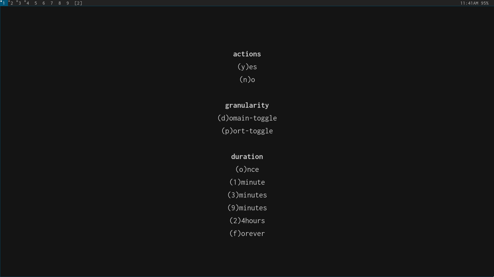

## why

it should be easy to monitor and control inbound and outbound connections.

## what

an interactive firewall for inbound and outbound connections.

the rules are global, but the prompt always shows the pid/path/args of the program requesting a new rule.

based on the excellent [opensnitch](https://github.com/evilsock/opensnitch).

## demo

## dependencies

 - everything in `tinysnitch/bin` is a seperate component, with seperate dependencies. you can run them independently to make sure dependencies are correctly installed.

 - tinysnitchd:
   - [pypy3](https://pypy.org/)

 - tinysnitch-prompt
   - [python3](https://www.python.org/)
   - [pyqt5](https://pypi.org/project/PyQt5/)

## install

put `tinysnitch/bin` on your `$PATH`.

## usage

add the iptable rules with: `tinysnitch-iptables-add`

you probably want to save those rules and have them loaded on [system startup](https://wiki.archlinux.org/index.php/iptables#Configuration_and_usage).

tinysnitchd must be launched with sudo as a user process, so the subprocess pyqt5 prompts can actually show up on your screen.

either run it in a background terminal: `sudo -E tinysnitchd`

or automatically run it with cron: `* * * * * sudo -E auto-restart tinysnitchd 2>&1 | rotate-logs /tmp/tinynitchd.log`

[auto-restart](https://gist.github.com/nathants/dc5d43c1e57b9bbb3a654491df93e4d6) and [rotate-logs](https://gist.github.com/nathants/72968aaa7d9ab7c008fe32e399426d2c) are not convenient, not required.

## rules

permanent rules are stored in `/etc/tinysnitch.rules`, and `tinysnitchd` will reload the rules when edited.
